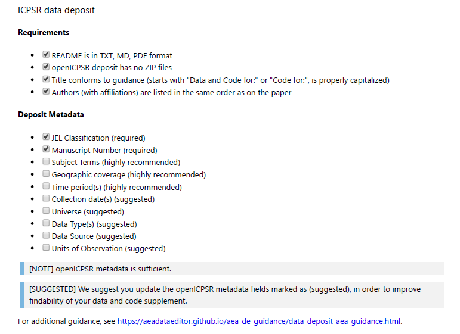
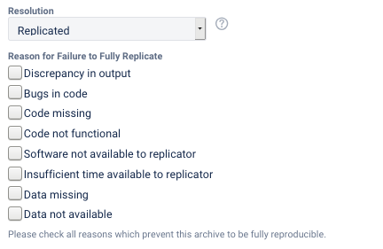
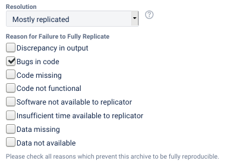

(a-guided-walk-through-the-replication-report)=
# A guided walk through the Replication Report

In order to work through a replication report, you will need

- [Access to computers](`r config$url$replmd`Access_to_computers.md)
- Reviewed the [Template REPORT](`r config$url$templmd`REPLICATION.md) 
<!-- Access to computers link does not work-->

We have examples of various actual reports (slightly anonymized):

 + [Example 1](`r config$url$replmd`sample_report.md)
 + [Example 2](`r config$url$replmd`REPLICATION-AEAREP278.md)
 + [Example 3](`r config$url$replmd`REPLICATION-AEAREP282.md) and its [revision](`r config$url$replmd`REPLICATION-AEAREP282-revised.md)

## Some high-level concepts

### On data documentation

The [Social Science Data Editor's page on Data documentation](https://social-science-data-editors.github.io/guidance/Requested_information_data.html) provides guidance:

  + Identifying all data
  + What is great / good / just-good-enough data documentation
  + Citing data!

### On code documentation

The [Social Science Data Editor's page on Code and documentation](https://social-science-data-editors.github.io/guidance/Requested_information_code.html) provides guidance:

  + What do we consider to be "code"
  + Assessing the quality of the code documentation

### To come

How to modify code for replicability/verification

## What's in a replication report

The template used by the Lab can be found on Github [here](`r config$url$templmd`REPLICATION.md). The table of contents looks like this:

- SUMMARY &ast;
- Data description &ast;
- Data checks &ast;
- Code description &ast;
- Stated Requirements &ast;
- Missing Requirements &ast;
- Computing Environment of the Replicator
- Replication steps
- Findings
- Classification

We note that those sections marked "&ast;" can be completed before ever running any author-provided code, even when data are confidential. They lead to a preliminary report, which is a "dry" assessment of the completeness of the replication package. 

In most sections, when elements are missing, wrong, or do not work, we use a [standardized set of action items](`r config$url$templmd`sample-language-report.md) to highlight this. 

### Summary

The SUMMARY is intended for a quick glance by journal editor and authors. It should be short and succinct, with a bulleted (unduplicated) list of action items for the authors, drawn from the rest of the report. It is the first thing editors and authors will see. 

###  Data description

The data description can require substantial time to complete. The replicator is asked to identify all `input` (original) data sources used by the authors. It sometimes is useful to create a working list (spreadsheet) and commit the list together with the report. The ACRE project has a [useful template](`r config$url$acre`assessment.html#describe-inputs), but any list will suffice here. In addition, we ask replicators to  fill out the "Data Citation and Information report", to obtain a machine-readable list of data sources and their attributes. 

An essential part in writing the data descrption section is identifying the data used in the analysis. While the dataset used for the main analysis is often explained in the README or in the manuscript, the description of other datasets (e.g. datasets used in the appendix, introduction, or in a figure describing the study settings) are sometimes omitted in the provided documents.

Once the preparations above are completed, a summary should be written in the "Data Description" section. 

#### What data need to be described?
All "`input` (original) data sources" and "Analysis data files" should be listed. 
   
- Data needs to be listed include:
   - Any data used to produce tables, figures, and in-text numbers that presents the estimated results, summary statistics, or any other numbers that are calculated from the data
   - Data used to create maps.
      - The data source of the geographical information is a source data if the map is created by the authors. 
- Data need not be listed include:
   - Source data for the numbers or estimates directly quoted from other aritcles 
   - Souce data for the parameters used for calibrations, unless they are estimated within the article.

#### Source data

For each data source, list 

- presence or absence of source data (data files), 
- presence or absence of codebook/information on the data, and summary statistics. Summary statistics and codebook may not be necessary if they are available for public use data. In all cases, if the author of the article points to an online location for such information, that is OK. 
   - The information of the source location of the data should instruct the replicator how to access the source data.
   - A replicator should validate the provided description of the access information by visiting the link, downloading the dataset from the link, and compare the downloaded dataset with the provided dataset.
- whether the *data* is cited (see the section on [data citations](#datacitations). Note that when authors cite data supplements, both the article and the data supplement should be cited - often, the latter is missing. 

#### Analysis data files

Analysis data files are the data files from which output tables and figures are produced directly. If any analysis data files are provided and found, they are listed. Analysis data files are produced by code in the deposit from data sources. Not every deposit will have these, and in some cases, there may be ambiguity if a data source is not clearly defined. In some cases, replicators will identify surplus data - data not associated with any source and any program. Authors are then asked to clarify this information.

### Metadata checks on deposit

Most replication packages received by the LDI Replication Lab will have been deposited in the AEA Data and Code Repository, but some may be on other trusted repositories (Dataverse, Zenodo, etc.).^[See the Social Science Data Editor website for a list of trusted repositories.] The replicators are asked to verify compliance with an AEA-specific list of required elements:

- [ ] JEL Classification (required)
- [ ] Manuscript Number (required)
- [ ] Subject Terms (highly recommended)
- [ ] Geographic coverage (highly recommended)
- [ ] Time period(s) (highly recommended)
- [ ] Collection date(s) (suggested)
- [ ] Universe (suggested)
- [ ] Data Type(s) (suggested)
- [ ] Data Source (suggested)
- [ ] Units of Observation (suggested)

If all required elements are provided, then the deposit passes. 
Many of the recommended elements are not applicable to all data deposits - for instance, a simulation has no "geographic coverage" or "collection date", but a survey clearly does. 

###  Data checks

When data are present, the replicator will run a few checks. These are not meant to be exhaustive, and are far less comprehensive than those suggested by trusted data curators. We ask for mostly simple checks, but which are known to fail. These are mostly checks that ensure some level of FAIR compliance.

- can data be read (using software indicated by author)? 
   - This is a plausibility check for corrupted data.
- Is data in archive-ready formats (CSV, TXT) or in custom formats (DTA, SAS7BDAT, Rdata)? 
   - Most trusted repositories will strongly suggest archive-ready formats, but there is a wide range of feasible formats. Our heuristic is that a format is "archive-ready" if it can be read by open-source software (not necessarily the original software). For instance, there are robust readers for Stata in R and Python, and so even though Stata formats are a proprietary format associated with commercial software, it is deemed acceptable. Exceptions we have found are files for Numbers (an Apple spreadsheet program that only works on MacOS) and Mathematica data files - neither have open-source readers. 
- Do the data files have variable labels and meaningful variable names? 
   - In other words, is it straightforward to understand what the data mean? Alternative, a codebook could be provided, that maps cryptic variable names (`Q25S3`) to meaningful labels. 

> Note that we do *not* require that variable *values* are provided here, nor that a full codebook is present or linked. Ideally, these would be here as well, and in some cases, we will go back to the authors and request them, *if* we think it is reasonable to do so  - a judgement call by the Data Editor.

- Replicators will run a simple check for personally identifiable information, if feasible, using a heuristic developed by J-PAL.^[The Stata version can be found [here](https://github.com/J-PAL/stata_PII_scan).] 
   - This check will have lots of false positives - fields it thinks might be sensitive that are not, in fact, sensitive. While replicators are asked to apply some judgement, the final decision must be made by authors, and the information is reported as such in the report.

###  Code description

All deposits should have code. In line with the [basic data flow](#dataflowdiagram), there should be both data cleaning or preparation code, as well as analysis code. The replicator will review the code (but will  not run it yet). 

- Identify programs that create "analysis files" ("data preparation code"). 
- Identify programs that create tables and figures. 

From the README, the replicator should be able to identify code to create all **figures, tables, and any in-text numbers**. If not listed in the README, comments in the code should enable the replicator to find this. The replicator will create a list, mapping each of figure, table, and in-text number to a particular program and line number within the program. A [template spreadsheet](`r config$url$templmd`code-check.xlsx) is provided. Note that the code description might already observe that setup programs are missing, but most missing code will be identified in the [findings][findings] section. 

###  Stated Requirements

The authors should have specified specific requirements in terms of software, computer hardware, runtime, add-on packages. The replicator should list them here. This is **different** from the Computing Environment of the Replicator. If all requirements are listed, check the box "Requirements are complete". This section is important to assess the feasibility of the reproducibility attempt. A reproduction that requires "20,000 core compute hours", or that "runs for weeks", or that requires custom software that needs to be acquired, may not be feasible. 

- [ ] No requirements specified
- [ ] Software Requirements specified as follows:
   - Software 1
   - Software 2
- [ ] Computational Requirements specified as follows:
   - Cluster size, etc.
- [ ] Time Requirements specified as follows:
   - Length of necessary computation (hours, weeks, etc.)

- [ ] Requirements are complete.

###  Missing Requirements

If it turns out that some requirements were not stated or are incomplete (software, packages, operating system), the replicator should  list the *complete* list of requirements here. This is usually amended as the reproducibility attempt progresses.

###  Computing Environment of the Replicator

Just as the original authors have a particular computing environment that a replicator needs to know in order to properly implement a reproducibility attempt, the replicator's own attempt is important. This section should *not* describe the laptop the replicator uses to write the report - that is irrelevant - but should provide as complete a list of details as possible describing the computer where the computational component of the reproducibility check was conducted. S Some of these details can be found as follows:

- (Windows) by right-clicking on "My PC"
- (Mac) Apple-menu > "About this Mac"
- (Linux) see code in `tools/linux-system-info.sh`

Examples might include:

- Mac Laptop, MacOS 10.14.6, 8 GB of memory (but only if you ran the analysis on the Mac Laptop!)
- CISER Shared Windows Server 2016, 256GB, Intel Xeon E5-4669 v3 @ 2.10Ghz (3 processors)
- CISER Virtual Windows Server 2016, 16GB, Intel Haswell 2.19 Ghz (2 processors)
- BioHPC Linux server, Centos 7.6, 64 cores; 1024GB RAM; 

The list should also list the software the replicator used, with the specific version used (even if the author did not list that information). Examples include:

- Stata/MP 16
- Matlab R2019a
- Intel Compiler 3.14152

###  Replication steps

For every replication or reproducibility attempt, the list of steps a replicator undertakes is important to be listed. In principle, these steps should be specified in the README, but while the README contains instructions, this section should contain what you actually did. It should include details as to under what name the replicator saved a dataset downloaded from a website (if not the suggested name), or what minor edits were made to programs. 

- DO not include trivial details ("I downloaded the code and saved on my Desktop"). 
- DO describe actions   that you did  as per instructions ("I added a config.do")
- DO describe any other actions you needed to do ("I had to make changes in multiple programs"), without going into detail (the commit log can provide that information)

The description should allow the Data Editor and the authors to understand that everything was done as instructed. Deviations need to be described with enough detail that somebody else can reproduce the deviation!

###  Findings

Once everything is put in place, the replicator can report on findings, both positive and negative. This should include enough detail to allow a reader - a Data Editor and the authors - to understand what went wrong when something went wrong. For each **Data Preparation Code, Figure, Table, and any in-text numbers**, the section should provide information on success or failure to reproduce (the previously filled out [code-check.xlsx](`r config$url$templmd`code-check.xlsx) can be re-used to drive the list). When errors happen, the replicator's description should be as precise as possible. For differences in figures, the replicator should provide both a screenshot of what the manuscript contains, as well as the figure produced by the code you ran, with differences highlighted. For differences in numbers (in tables or in-text), the replicator should list both the number as reported in the manuscript, as well as the number replicated. 

###  Classification

The replication report template used by the LDI Replication Lab uses a simplified scheme to summarize the reproducibility of the materials:

- Full replication can include a small number of apparently insignificant changes in the numbers in the table. Full replication also applies when changes to the programs needed to be made, but were successfully implemented.
-  Partial replication means that a significant number (>25%) of programs and/or numbers are different.  Note that if any data is confidential and not available, then at best a partial replication can be achieved. 
- Failure to replicate implies that only a small number of programs ran successfully, or only a small number of numbers were successfully generated (<25%). Most replication packages that rely on confidential data will also be in this category.

- [ ] full replication
- [ ] full replication with minor issues
- [ ] partial replication (see above)
- [ ] not able to replicate most or all of the results 

The Lab does not (yet) use a more refined reproducibility score, such as the one developed as part of the [BITSS ACRE Project](`r config$url$acre`assessment.html#score). The emphasis is on a summary measure, combined with detailed reasons why full reproducibility is not achieved.

The reasons for not being able to fully reproduce the materials can be multiple, and should be noted in the report (they are captured through a multiple-choice field in the LDI Lab's JIRA system):

- [ ] `Discrepancy in output` (either figures or numbers in tables or text differ)
- [ ] `Bugs in code`  that  were fixable by the replicator (but should be fixed in the final deposit)
- [ ] `Code missing`, in particular if it  prevented the replicator from completing the reproducibility check
- [ ] `Code not functional` is more severe than a simple bug: it  prevented the replicator from completing the reproducibility check
- [ ] `Software not available to replicator`  may happen for a variety of reasons, but in particular (a) when the software is commercial, and the replicator does not have access to a licensed copy, or (b) the software is open-source, but a specific version required to conduct the reproducibility check is not available.
- [ ] `Insufficient time available to replicator` is applicable when (a) running the code would take weeks or more (b) running the code might take less time if sufficient compute resources were to be brought to bear, but no such resources can be accessed in a timely fashion (c) the replication package is very complex, and following all (manual and scripted) steps would take too long.
- [ ] `Data missing` is marked when data *should* be available, but was erroneously not provided, or is not accessible via the procedures described in the replication package
- [ ] `Data not available` is marked when data requires additional access steps, for instance purchase or application procedure. 

Note that absence of full replication is not necessarily a reason to reject the replication package. The AEA regularly accepts replication packages that are not reproducible by the AEA Data Editor because the "data are not available" or because there is "insufficient time", as long as the replication package could plausibly be reproduced by somebody with extra time or with access to the data. The determination is made by the AEA Data Editor, based on the report. 

## Some additional materials

Here's a collection from older presentations:

 - [Elements of a replication report](Replication-Report-Overview.pdf)
 - [Replicator checklist](replicator_checklist.pdf)
