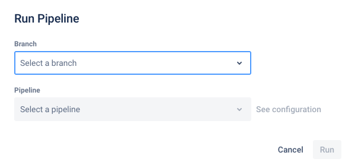
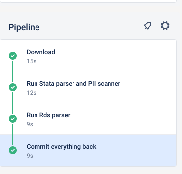

# Assigned  

When you are first assigned an issue, it will in the `Assigned` status. The first thing you must do is to either create a new repository (`Create repository`) , or reference an existing repository (if the issue is a [revision](aea-revision-reports-after-author-resubmission)) in order to move to `In Progress`.

- This lets us know that you have started working on replication.


```{note}
The link to JIRA is [https://aeadataeditors.atlassian.net/jira](https://aeadataeditors.atlassian.net/jira) (requires login).
```

```{warning}
Is the current Jira issue an **original report** (first time we see the manuscript) or **is it a revision** (we've seen the manuscript before)?
```

- [ ] Check the `MCStatus` field: 
  - If it says "`RR`" or "`CA`", then it is an "original report" - proceed to the next step (Creating a repository).
  - If it says "`CA` `Revision`", then it is ... a revision! 
    - Follow the instructions at "[Revision reports after author resubmission](aea-revision-reports-after-author-resubmission)".
    - In particular, **do NOT create a new repository** - you will re-use the previous repository. Enter the previous repository "stub" into the `Bitbucket short name` field.
    - In particular, **do NOT create "update" or "new" directories** The current state of the repository should always correspond to the author's structure. Overwrite files, delete files. The previous state is preserved in Git. This will also tell you what files have changed.
    - When running a second replication on the same archive, please be sure to have the committed "REPLICATION.md" be accurate when you commit it - do not let it contain holdover data from a previous replication attempt, as this can lead to confusion.
    - Once you have entered the previous repository "stub" into the `Bitbucket short name` field, you can proceed to `In Progress`.

## Creating a repository


```{warning}
In some instances, somebody else has already created a repository. Always check first if the `Bitbucket short name` is already filled out. If yes, skip this section and go to [Collecting information](collecting-information)!
```


- [ ] start by [creating a repository using the import method](https://bitbucket.org/repo/import) 
    - copy-paste from this URL to the URL field (this is also available in the Jira dropdown "Shortcuts")

    ```bash
    https://github.com/AEADataEditor/replication-template
    ```

    - the repository name should be the name of the JIRA issue, in **lower case** (e.g., `aearep-123`)
    - Be sure that `aeaverification` is always the "owner" of the report on Bitbucket. 
    - The Project should be the abbreviation of the journal (e.g. "JEP")
    - Keep the other settings (in particular, keep this a **private** repository).
    - Click `Import Repository`
    - Keep this tab open!


- We have now created a Bitbucket repo named something like aearep-123 that has been populated with the latest version of the LDI replication template documents!

(ingesting-author-materials)=
## Ingesting author materials

We will now ingest the authors' materials, and run a few statistics. Typically, the materials will be on a (private) openICPSR repository. Sometimes, the materials will be at Dataverse, Zenodo, or elsewhere.

- If at openICPSR, the fields `Replication package URL`, `openICPSR alternate URL`, and `openICPSR Project Number` will be filled.
- If at Zenodo or Dataverse, the `Replication package URL` will have the DOI of the replication package, `openICPSR alternate URL` and `openICPSR Project Number` will be empty.


```{note}
This currently works reliably only for openICPSR. This documentation will be updated when it works for Dataverse and Zenodo as well.
```

You will now run what is called a *`Bitbucket Pipeline`*. Similar tools on other sites might be called `Continuous integration`, `Github Actions`, etc. If you have encountered these before, this will not be news for you, but it isn't hard even when this new.

- First, in the repository you just created, navigate to the `Pipelines` tab


- Because this is new, you will see the "Run initial pipeline" page. Click on `Run initial pipeline`.


- You will now need to select a "pipeline" to run. 



- Choose "`populate from ICPSR`" (might change in the future), and fill in the ID for the relevant source of the replication package (here: openICPSR ID = `123456`), and hit `Run`.


- Your pipeline will start, working through various steps. This might take a while! Do the next step ([Collecting Information](collecting-information)) then come back here.


- [ ] Once your pipeline is done, check that it is green.
  - If for some reason, it fails, the logs are available for your supervisor to inspect, and to help you. You may then need to do [the manual steps later](Manual1).



(collecting-information)=
## Collecting information 

At this stage, you are collecting information. 

- [ ] Fill out the following fields in the Jira ticket (some may be pre-populated):
    - [x] `Replication package URL` In almost all cases, this is the openICPSR repo for which you will have received a notification email.
      - If code and/or data are provided by email, `Replication package URL` should be filled out with  "https://email", otherwise with a DOI or URL.
    - [x] `Journal` 
    - [x] `Manuscript Central identifier`
    - [ ] `Bitbucket short name` (e.g., `aearep-123`) 
      - this should then auto-fill  `Git working location`.
- The following fields, located in the **REPL. INFO** tab area 2 of the screen, must also be filled out:
  
    - [ ] `Empirical Article`: "Does the article contain empirical work, simulations, or experimental work?" 
      - typically the answer should be "Yes". You should answer "No" only if you read the article and find that it is entirely theoretical, no simulations or empirical work at all.
    - [ ] `RCT`: Is the paper about a randomized control trial? This should be immediately obvious from the abstract.
      - `RCT NUMBER`: If it is an RCT, fill in the associated RCT registration number (typically in the title page footnote)

You can now proceed to change the status to `Code`.
