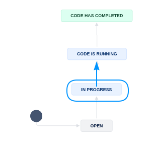
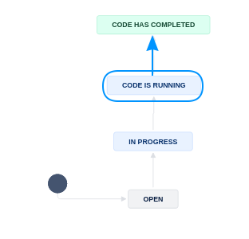

(running-code-partb)=
# Running Code (Part B)

In this stage, you will run the code, by using the provided data. The `REPLICATION.md`  is the report!


## Signal that you are working on Part B

To signal that you are starting to run the code, you will now transition the JIRA subtask to "`Code is running`".




## Principles

Keep a log of what you do, what you find, and what does not work, in the `REPLICATION.md`, under *Findings*.

You should also run code so that it generates an actual "log file". How to do this depends on the software. 

:::{admonition} We have an [entire section of the manual](running-code-general) for this!

Check the software-specific guidelines in the manual's [section on running code](running-code-general), debug the code, and set the code to run.
:::

:::{note}

Sometimes, code can run for a long time. Leave the Jira ticket in `Code is running` to signal that there is activity there. Remember to come back regularly to check on it, and remember to commit all changes immediately (before running code).
:::

Once you have run the code, come back here to continue!

## Details

- If code runs for a long time, record in the Jira issue (as a comment) when you started the code. 
- Use the `Computing Environment` to record where (CCSS, BioHPC node, etc.) you started the code.
- It is not unusual for code to run for several days. You can start a new case in the meantime!

## Wrapping up

Once the code has run, **error-free and creating the intended output** (as far as you can tell), it is time to wrap up this sub-tasks.

```{note}

You, or somebody else, will compare the output to the manuscript in the next step! You may, however, simply check that output exists, regardless of its specific content, before moving forward.
```

