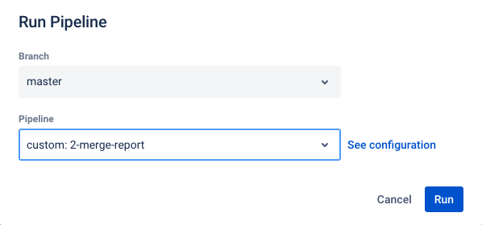
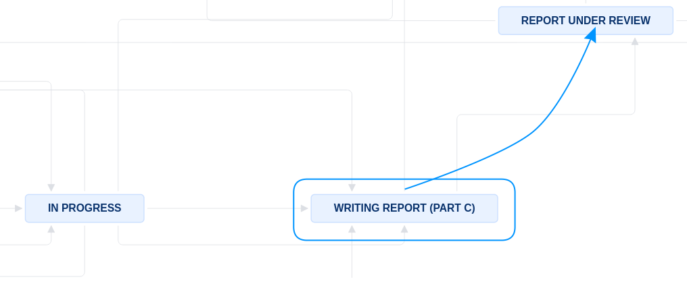

(partc)=
# Writing Report

At this stage, you will write the final version of the report.

## Signalling where you are

Move the Jira issue to "`Writing report`". 


:::{admonition} In order to do so:

- Check that both sub-tasks (part A and part B) are marked as "`Done`".

::: 

You should now be able to select "`Write report`" from the dropdown menu. A pop-up will appear, asking you to fill out the fields and confirm the transition. 


:::{admonition} Important!

You should choose here the "`Resolution`" that corresponds to the outcome of the replication. This is preliminary - you will be able to adjust it after completing Part C, but based on what you observed in Part B, you may already have a good idea of the outcome. If uncertain at this point, choose `x-------x`.

:::

## Run the Merge Pipeline

At this point, there will be two parts of the report: `REPLICATION-partA.md` and `REPLICATION-partB.md`. To facilitate further editing, we will merge these two parts into a single file, `REPLICATION.md`. This can be done manually, or using the pipeline.

:::::{tab-set}

::::{tab-item} Using the Pipeline

Run the pipeline to merge the two parts. 

:::{admonition} Important!

Be sure to have committed and pushed **all** changes to the repository before running the pipeline.

:::

:::{admonition} Finding the Pipeline menu
:class: dropdown tip

- First, in the Bitbucket repository for your issue (you can find the link under `Repl.info` -> `Git working location`) , navigate to the `Pipelines` tab


- You will now need to select a "pipeline" to run. 


:::

- Choose "`2-merge-report`" (might change in the future), and hit `Run`.



- Your pipeline will start. It will be very quick, and update the repository with the merged file.

- Back on your computer, pull the changes from the repository. You should now see a new file, `REPLICATION.md`.

```bash
git pull
```

::::

::::{tab-item} Manual Merge

If you want to do this on your own computer, you can use one of two methods:

- Using the command line:

```bash
cat REPLICATION-partA.md REPLICATION-partB.md > REPLICATION.md
```

- Manually, using a text editor:
  - Open the two files `REPLICATION-partA.md` and `REPLICATION-partB.md` in a text editor
  - Copy the contents of `REPLICATION-partB.md` and paste them at the end of `REPLICATION-partA.md`
  - Save the file as `REPLICATION.md`

- In both cases, you now need to remove the parts, and add the combined file:

```bash
git rm REPLICATION-partA.md REPLICATION-partB.md
git add REPLICATION.md
git commit -m "Merged parts A and B"
git push
```

::::

:::::


## Standard steps

- Compare images and tables
  - Some of this may involve "squinting" at images...
  - For tables that are output to Excel, you may be able to use some Excel tools (copy the old numbers, create a difference function between all cells). This is hard to provide examples for, as every table differs.
  - For tables that are output as LaTeX (files ending with `tex`) or as  CSV files, *and* if the authors provided previous versions, you may be able to use Bitbucket to compare them globally, without looking at individual numbers (see **Comparing TeX files on Bitbucket**).

```{warning}
We want to learn about ALL differences that you see, even if minor. 
```

- When there are differences: Include images of figures and screenshots of tables (both paper and as-reproduced) in the report
  - For paper images, use a screenshot tool to grab them from the `PDF_Proof.PDF` and save them as PNG.
  - For reproduced images, reference the location within the replication directory.
  - Using an annotation tool on your computer, circle or highlight where you see differences.

Example:

```

Figure 5 in the paper:


Figure 5 as reproduced:


```

- Highlight differences:
    - if only a small number of table entries: mention them by table in the report
    - if a larger number: Highlight on the reproduced images (of figures, screenshots of tables) the differences you have observed
- If there are **too** many differences, let us know immediately, we may then simply send back to the authors with the raw output, and let them address it. 

- There is sample language for commonly encountered problems at the [sample-language-report.md](https://github.com/AEADataEditor/replication-template/blob/master/sample-language-report.md) link in the tall grey bar


:::{admonition} Advanced: Comparing TeX files on Bitbucket
:class: dropdown

If the authors provided LaTeX files as part of the replication package, you may be able to leverage Bitbucket or Git to compare them. 

- Note first that the typical table when output, if identical, will not register as "modified" with Git. 
  - Check the date stamps - if the date is the date you ran the code, then the files were, in fact, replaced, but are not any different.
  - Alternatively, before you run the code, but after you have written the preliminary report, delete all the TeX files (do not git commit!), then run the code. 
  - If the files are reproduced, but git shows no difference, they are identical.
- If for some reason there is a change in platform, git might see a difference, but it is solely the "whitespace" encoding, which differs between Mac, Linux, and Windows. In that case, proceed as follows.
- `git add *tex` then `git commit` and `push` as usual.
- Navigate to the Bitbucket repository, and select the tab "`Commits`". Click on the commit you just made.
- You should see a list of files. Click on the first of the `tex` files you want to inspect.
- You might see the following information:


- Click on the "`give it another chance`". You will now see (or were already seeing) a "git diff", identifying first the old lines (in red), then the new lines (in green). This list can be long.


- Navigate to the right of the screen. Choose from the dotted menu the item "Ignore whitespace" (you only need to select the "whitespace" option for the first file).


- The page will recalculate the "diffs". If you see the "`give it another chance`", click it again. YOu should now, if the files are truly the same, see the following:


- Do this for all `tex` files (you only need to select the "whitespace" option for the first file). If you scroll up to the summary again, you should see a count next to the file. This shows the number of lines changed, taking into account the "whitespace" option.


:::

## Cleaning up

- Clean up the REPLICATION.md - it should be factual, objective, and not written in the first person.
- Copy-and-paste from the `code-check.xlsx`, including the column "Reproduced?" and any notes column, into the "Findings" part. Use the [Excel-to-Markdown plugin](https://marketplace.visualstudio.com/items?itemName=csholmq.excel-to-markdown-table) for VSCode. 
- Delete all of the instructional lines in REPLICATION.md  before finishing the report.

## On Jira

- Check that the `DataCitationSummary` field is filled out indicating how many data citations are in order: all, some, or none. 
- Check that the `Report Location` is filled out. 
  - If it is, do not change it.
  - If for some reason, it is missing, enter the full URL from the repository, e.g. `https://bitbucket.org/aeaverification/aearep-123/src/master/REPLICATION.md`


You can now submit your report for review by changing the status to `Under Review`


